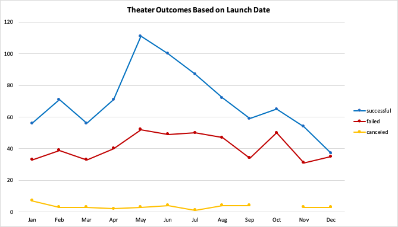
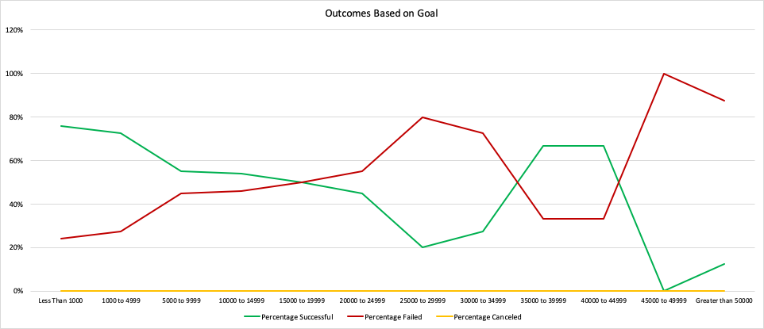

# Kickstarting with Excel

## Overview of Project

### Purpose
I performed analysis on Kickstarter data in order to uncover useful trends about different campaigns in relation to their launch date and their funding goals. By organizing, sorting and creating visuals I determined how these factors relate to the outcome of a campaign. 

## Analysis and Challenges

### Analysis of Outcomes Based on Launch Date
First I created a new 'Years' column and used the YEAR() function to extract the year from the 'Date Created Conversion' column. Then I created a pivot table filtered by parent category and years. It displays the number of successful, failed and canceled theater campaigns grouped by the month they were launched in. Then I added a line graph to visualize the relationship between outcomes and launch month.

### Analysis of Outcomes Based on Goals
I created a table containing data about the outcomes of campaigns for plays grouped by goal amount ranges. I filled the columns with the number, total and percentage of campaigns for plays based on specific outcomes by using the COUNTIFS() and SUM() functions. Then I added a line chart to visualize the relationship between the goal amount ranges and the percentage of successful, failed and canceled campaigns.

### Challenges and Difficulties Encountered
My first challenge was understanding the role of each pivot table field. In order to learn how the categories interact I created a few different pivot tables while paying attention to the effects of adding or removing different items to each field.
Another challenge I faced was learning how Excel functions work, specifically COUNTIFS and IFERROR. After referencing the Excel documentation, I was able to understand the functions and apply them in my research. 

## Results

- What are two conclusions you can draw about the Theater Outcomes based on Launch Date?

In the 'Theater Outcomes Based on Launch Date' graph, it can be clearly seen that the highest number of successful theater Kickstarter campaigns were started in May. Additionaly, the lowest number of successful theater campaigns were started in December. 

- What can you conclude about the Outcomes based on Goals?

In the 'Outcomes Based on Goals' graph, it is noticeable that the highest percentage of successful campaigns for plays had a goal amount of less than $1,000. While there were only 9 campaigns for plays with goal amounts from $35,000 to $44,999, 67% of them were successful. The highest number of total projects (534) had a goal amount from $1,000 to $4,999 and 73% of them were successful.
The only campaign for a play with a goal amount of $45,000 to $49,999 failed and 88% of campaigns for plays with goal amounts greater than $50,000 also failed. 
The yellow line shows us that there were no canceled campaigns for plays. 

- What are some limitations of this dataset?

It is possible that other crowdfunding projects have different trends. There are also many other factors that could have impacted the pledged amounts and/or outcomes that are not part of the data (i.e. forms of advertisement). In addition, since the currencies differ, comparing the goal and pledged amounts could lead to inaccurate conclusions. 

- What are some other possible tables and/or graphs that we could create?

We could graph the relationship between the length of a campaign and the outcome. We could also graph outcomes based on average donations or percent funded based on the lengths of the campaigns.
